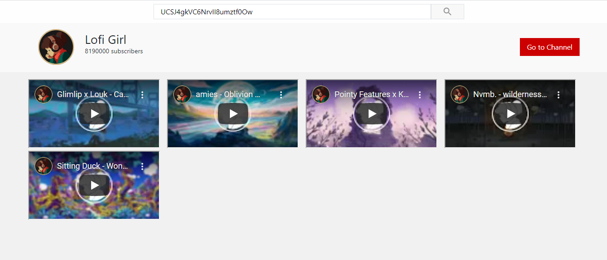

<h1 align="center">Youtube viewer</h1>
<p align="center"><i>Watch last uploaded videos from any channel</i></p>
<hr>



# Youtube viewer
Youtube viewer can be used to view last _n_ videos from any channel.

## Getting started
Follow these steps to install and run project:
- Clone the project with ```https://github.com/dbelik/youtube-viewer.git```
